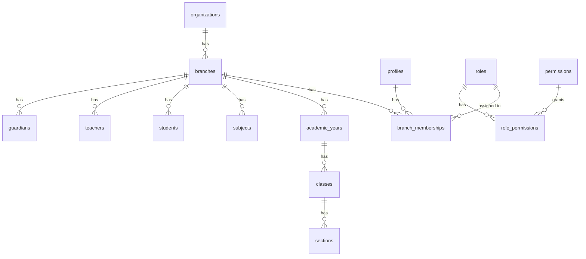

# SchoolOS — Architecture Readiness Report

## 1. Executive Summary

The current repository represents a clean slate, with no existing application code, backend configuration, database schema, tests, or CI/CD pipelines detected. The repository currently consists exclusively of the `SchoolOS_Master_Specification_FINAL` directory (which contains the master specification markdown files) and the newly created `docs` directory.

Because there is no legacy code or infrastructure, the repository is highly suitable for implementing the new SchoolOS architecture from scratch. There is nothing that needs to be rebuilt, refactored, or removed, and no existing architectural constraints (such as improper tenant isolation or outdated frameworks) to work around.

However, the major architectural risks stem from the complexity of the target architecture itself, specifically:
- Ensuring strict Row-Level Security (RLS) policies to prevent cross-branch data leakage in a multi-tenant centralized database.
- Orchestrating a "Branch App Factory" capable of generating distinct Android and iOS applications from a shared codebase without cloning.
- Implementing a robust and flexible RBAC system that correctly intersects with organization and branch memberships.

## 2. Specification Understanding

The target architecture for SchoolOS is a modular monolith that supports a multi-tenant model. The hierarchy is:
```text
Organization
    ↓
Branches
    ↓
Branch-specific apps
    ↓
Centralized backend/database
```

Key differences:
- **App separation**: Each branch will have its own distinct client application (Android/iOS) built from a shared factory, resulting in separate package IDs, bundle IDs, and branding.
- **Data separation**: All branches and organizations will share a single, centralized PostgreSQL database. Data is not physically separated into different databases or schemas.
- **Authorization separation**: Because data is centralized, authorization separation must be strictly enforced at the database level using Row-Level Security (RLS) policies, ensuring that users only access rows belonging to their branch and role.

## 3. Current Technology Stack

| Area     | Detected technology | Version | Evidence | Confidence |
| -------- | ------------------- | ------- | -------- | ---------- |
| Web      | None                | N/A     | Empty    | High       |
| Mobile   | None                | N/A     | Empty    | High       |
| Backend  | None                | N/A     | Empty    | High       |
| Database | None                | N/A     | Empty    | High       |
| Auth     | None                | N/A     | Empty    | High       |
| Storage  | None                | N/A     | Empty    | High       |
| Testing  | None                | N/A     | Empty    | High       |
| CI/CD    | None                | N/A     | Empty    | High       |

## 4. Current Repository Structure

The current repository contains no application source code.

```
/
├── SchoolOS_Master_Specification_FINAL/
│   ├── modules/
│   ├── templates/
│   └── (48 Markdown specification files)
└── docs/
    └── ARCHITECTURE_READINESS_REPORT.md
```

## 5. Existing Database Assessment

- **Tables**: None
- **Important relationships**: None
- **Migrations**: None
- **RLS**: None
- **Functions**: None
- **Triggers**: None
- **Indexes**: None
- **Constraints**: None
- **Possible tenancy problems**: None currently exist.

## 6. Existing Authentication and Authorization Assessment

- **Authentication**: No authentication system is currently implemented.
- **Roles**: No roles are currently implemented.
- **Branch membership**: No branch membership is currently implemented.
- **Organization membership**: No organization membership is currently implemented.
- **Authorization**: No authorization logic exists.
- **RLS**: No RLS policies exist.
- **Security gaps**: As there is no code, there are no existing security gaps. The primary future risk is failing to implement comprehensive RLS as specified.

## 7. Target Tenancy Model

```text
Organization
    ↓
Branch
    ↓
Membership
    ↓
Role
    ↓
Permission
    ↓
Resource scope
```

The system will use a centralized database where a single Organization can have multiple Branches. Users (Profiles) gain access to a Branch via a Branch Membership. That Membership assigns them a Role. The Role consists of multiple structured Permissions (e.g., `students.student.read`). Finally, the Resource Scope defines whether the user can access all records in the branch, only records assigned to them, or only their own records. This model will be enforced both at the application/API layer and deep in the database via RLS.

## 8. Target Database Model



## 9. Target RLS Strategy

Row-Level Security (RLS) is the bedrock of the architecture's data isolation.

- **Organization scope**: Users can access organization-level settings if they have an organization admin membership.
- **Branch scope**: A user can access records where `branch_id` matches the branch in their active session context.
- **Assigned-resource scope**: A teacher or staff member can only access resources (like specific classes or sections) explicitly assigned to them.
- **Own-record scope**: A user (student/parent) can only access records directly tied to their `profile_id`.
- **Parent/child scope**: Guardians can access records belonging to students linked to them via guardian relationships.
- **Super Admin scope**: Super Admins bypass branch-level RLS using dedicated DB roles or policies based on a super-admin claim.

**Careful Policies Required**:
- `profiles` and `auth.users` (cross-branch potential)
- `branch_memberships` (risk of privilege escalation)
- `financial_transactions` (critical integrity risk)
- `grades/marks` (privacy risk)

## 10. Target RBAC Model

| Action / Resource | Super Admin | Org Admin | Branch Admin | Principal | Accountant | Teacher | Librarian | Transport Mgr | Parent | Student |
| :--- | :--- | :--- | :--- | :--- | :--- | :--- | :--- | :--- | :--- | :--- |
| **Org Mgmt** | All | All | None | None | None | None | None | None | None | None |
| **Branch Config** | All | All | Read/Update | Read | None | None | None | None | None | None |
| **Staff Mgmt** | All | All | All | Read/Update | None | None | None | None | None | None |
| **Student Data** | All | All | All | All | Read | Read (Own) | Read | Read | Read (Child) | Read (Own) |
| **Fees/Invoices** | All | All | All | Read | All | None | None | None | Read (Child) | Read (Own) |
| **Exams/Marks** | All | All | All | All | None | Enter/Update | None | None | Read (Child) | Read (Own) |

*Note: Specific capabilities (e.g., `<domain>.<resource>.<action>`) will be mapped to these roles during module implementation.*

## 11. Branch App Architecture

A repeatable "Branch App Factory" will produce distinct applications from a single shared codebase without cloning the repository.

- **Configuration**: Branch configurations (logo, app name, theme, enabled modules) will be managed via the database and injected at build time.
- **Branding**: White-labeling will be achieved using build scripts that dynamically swap assets (icons, splash screens) and generate configuration files before compilation.
- **Package IDs / Bundle IDs**: Build tools (e.g., Fastlane) will dynamically inject specific package/bundle IDs based on the branch configuration to ensure the apps can be published independently to the App Store and Google Play.
- **Notification identity**: Push notification certificates and server keys will be mapped to branch-specific bundle IDs on the backend.
- **Build flavors/configuration**: Standard build variants will be used, parameterized by a branch identifier passed via environment variables during CI/CD execution.
- **Environment handling**: Environment variables will define the base API URL and standard keys, while branch-specific context will be resolved at runtime or build time depending on the secret level.

## 12. Module Dependency Map

```text
Foundation (Auth, Orgs, Branches, RBAC)
   ↓
People (Profiles, Students, Staff, Guardians)
   ↓
Academics (Years, Classes, Sections, Subjects)
   ↓
Scheduling (Timetables)
   ↓
Attendance
   ↓
Exams
   ↓
Finance (Fees, Payroll)
   ↓
Supporting modules (Transport, Library, Inventory)
```
*Foundation, People, and Academics must be built and validated before any other module.*

## 13. Reuse vs Rebuild Assessment

| Existing component | Reuse | Rewrite | Remove | Reason |
| ------------------ | ----- | ------- | ------ | ------ |
| None               | N/A   | N/A     | N/A    | The repository is empty; everything must be built from scratch. |

## 14. Risks

1. **[CRITICAL] Cross-branch data leakage**: Flaws in RLS policies or session management could allow users to see data from other branches.
2. **[CRITICAL] Authentication/Authorization bypass**: Improper RBAC implementation could lead to privilege escalation.
3. **[CRITICAL] Financial integrity**: Inadequate transaction handling in the Finance module could lead to incorrect fee balances.
4. **[HIGH] Schema migration complexity**: Managing zero-downtime migrations on a massive multi-tenant database as schemas evolve.
5. **[HIGH] App configuration scalability**: Managing automated builds, certificate renewals, and store deployments for hundreds of distinct branch apps.
6. **[MEDIUM] Performance degradation**: Large multi-tenant tables require careful indexing and query optimization to avoid slow downs.
7. **[MEDIUM] Deployment orchestration**: Releasing breaking backend changes requires coordinating updates across all published branch apps.
8. **[LOW] Client ownership disputes**: Clear definitions of data export capabilities are needed to assure clients of data portability.

## 15. Contradictions / Missing Decisions

- **Unknown**: What specific mobile framework (React Native, Flutter, Swift/Kotlin) will be used for the Branch App Factory?
- **Unknown**: What specific backend framework and database provider (e.g., Supabase, raw PostgreSQL, Node.js API) will be used?
- **Decision required**: Will the branch apps be distributed via standard App Stores (requiring Apple/Google review for each branch) or via enterprise distribution / B2B methods?
- **Decision required**: How will push notification credentials (APNs/FCM) be centrally managed for hundreds of apps without hitting provider limits?

## 16. Recommended Architecture Baseline

- **Database**: Centralized PostgreSQL with strict Row-Level Security (RLS) enforcing the `branch_id`.
- **Backend API**: A modular monolith providing stateless REST/GraphQL APIs, relying on JWTs containing the current `branch_id` and role claims.
- **Frontend/Mobile**: A single cross-platform codebase (e.g., React Native/Expo or Flutter) utilizing dynamic build configurations (via Fastlane) to inject brand assets and bundle IDs for each branch.
- **Authentication**: A unified Auth service (e.g., Supabase Auth or Firebase) with custom claims driving the RBAC engine.
- **Hosting/CI**: Automated CI/CD pipelines orchestrating the "Branch App Factory" builds and zero-downtime backend deployments.

## 17. Phase 1 Implementation Plan

1. Organization
2. Branches
3. Profiles
4. Memberships
5. Roles
6. Permissions
7. Authentication integration
8. RLS foundation
9. Audit foundation
10. Branch configuration
11. Super Admin foundation
12. Branch-app configuration
13. Security test suite

## 18. Architecture Readiness Verdict

```text
READY
```
The repository is completely clean. There is no technical debt, legacy code, or incorrect architectural patterns to unravel. The specification is comprehensive and provides a clear blueprint for the modular monolith and multi-tenant RLS strategy. We are fully ready to begin Phase 1 (Foundation) implementation.
