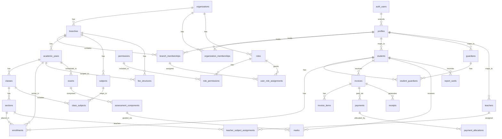

# SchoolOS — Final Conceptual ERD

```mermaid
erDiagram
    organizations ||--o{ branches : has
    organizations ||--o{ organization_memberships : has
    organizations ||--o{ roles : has
    roles ||--o{ role_permissions : has
    permissions ||--o{ role_permissions : included_in
    auth_users ||--o{ profiles : extends
    profiles ||--o{ organization_memberships : holds
    profiles ||--o{ branch_memberships : holds
    branches ||--o{ branch_memberships : contains
    branch_memberships ||--o{ user_role_assignments : assigned
    roles ||--o{ user_role_assignments : grants
    
    %% Academics
    branches ||--o{ academic_years : has
    academic_years ||--o{ classes : has
    classes ||--o{ sections : has
    branches ||--o{ subjects : has
    classes ||--o{ class_subjects : includes
    subjects ||--o{ class_subjects : maps_to
    
    %% People
    profiles ||--o{ students : maps_to
    profiles ||--o{ guardians : maps_to
    profiles ||--o{ teachers : maps_to
    students ||--o{ student_guardians : has
    guardians ||--o{ student_guardians : has
    students ||--o{ enrollments : has
    academic_years ||--o{ enrollments : active_in
    sections ||--o{ enrollments : placed_in
    teachers ||--o{ teacher_subject_assignments : assigned
    sections ||--o{ teacher_subject_assignments : teaches
    
    %% Finance
    branches ||--o{ fee_structures : has
    academic_years ||--o{ fee_structures : scoped_to
    students ||--o{ invoices : receives
    invoices ||--o{ invoice_items : has
    invoices ||--o{ payments : paid_via
    payments ||--o{ payment_allocations : allocated_by
    invoices ||--o{ receipts : generates
    
    %% Exams
    academic_years ||--o{ exams : scheduled_in
    exams ||--o{ assessment_components : comprises
    assessment_components ||--o{ marks : graded_via
    students ||--o{ marks : receives
    students ||--o{ report_cards : receives
```
